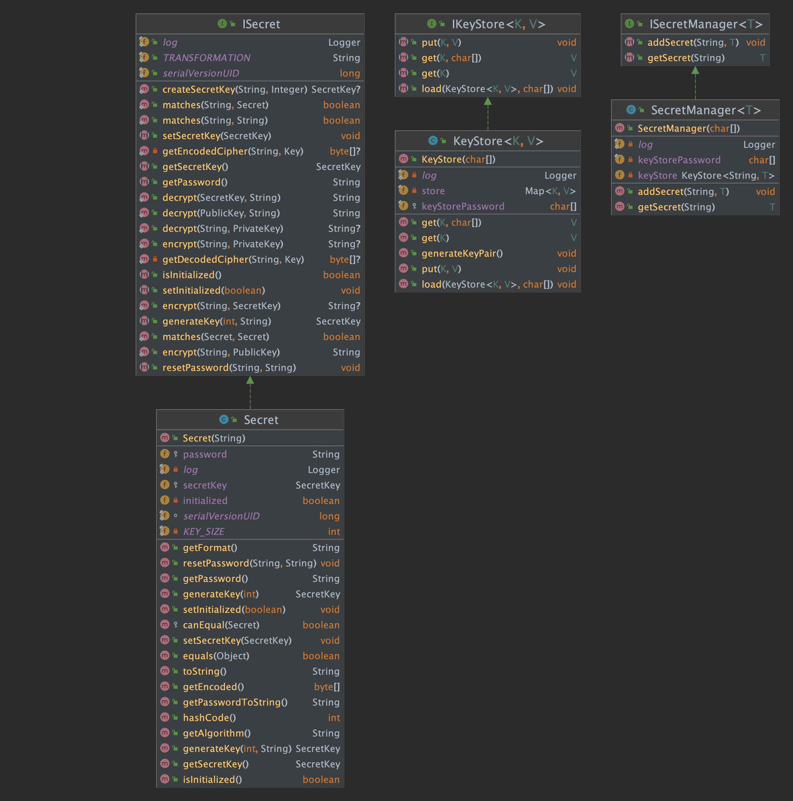

# Secret Management Design Pattern

The secret management design pattern is a software design pattern that provides 
a secure and centralized way to manage sensitive information, such as passwords, 
access keys, and certificates. It helps ensure that these secrets are stored and 
accessed in a secure and controlled manner, and helps prevent the accidental 
exposure of these secrets.

There are several key components to the secret management design pattern:

1. `Secrets Store`: This is a secure storage location for the secrets. It should be 
protected by strong access controls, and may be encrypted to further protect the secrets.
2. `Secret Provider`: This is an interface or API that allows authorized parties to 
access the secrets from the secrets store. It may include features such as 
authentication and authorization to ensure that only authorized parties can access 
the secrets.
3. `Secret Rotator`: This is a component that is responsible for rotating secrets on 
a regular basis. This helps to reduce the risk of secrets being compromised, as it 
limits the amount of time that a given secret is in use.
4. `Secret Injector`: This is a component that is responsible for injecting secrets 
into the application or system that needs to use them. This may be done through 
configuration files, environment variables, or some other means.

By following this design pattern, you can ensure that your secrets are stored and 
managed in a secure and controlled manner, and that they are only accessed by authorized 
parties. This can help to reduce the risk of secrets being compromised and can help 
protect the security and integrity of your systems.

This `SecretManager` class stores secrets in a `HashMap` with a string key and a 
generic value. The `addSecret` method allows you to add a secret to the 
SecretManager, and the `getSecret` method allows you to retrieve a secret 
by its key.

You can use this `SecretManager` class to store any type of secret, such as 
passwords, API keys, or sensitive data.

---

### Secret Management UML Diagram

