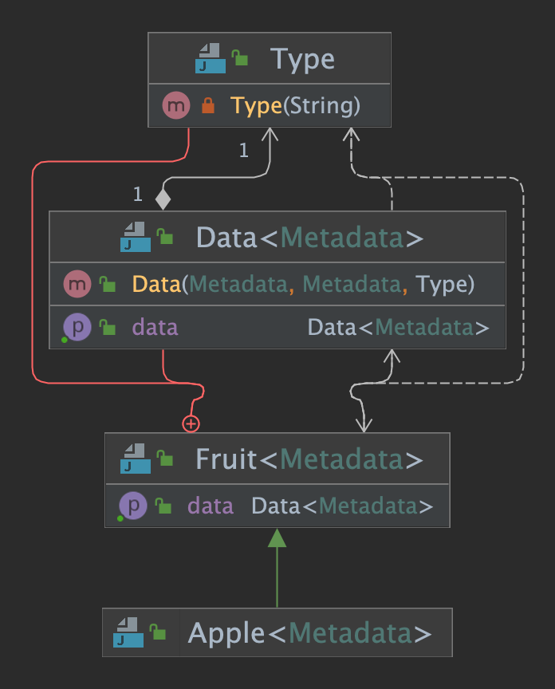
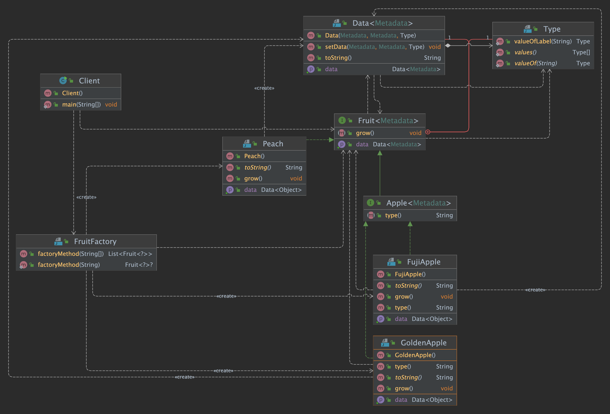
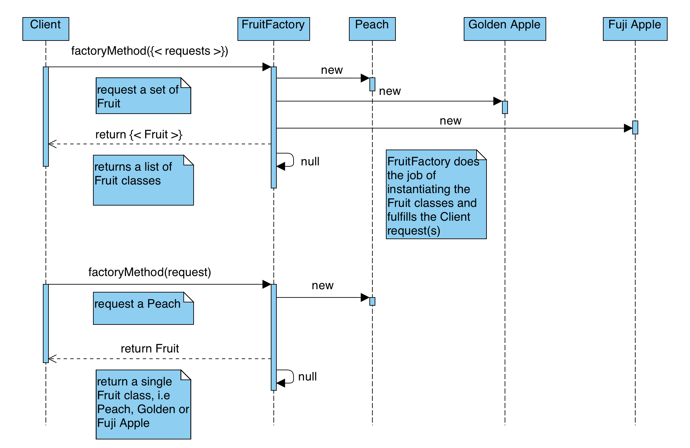

# Factory Method Design Pattern

## Purpose

- Returns an instance of one of several possible classes, depending on the data provided to it.
- Usually all of the classes it returns have a common parent class and common methods, but each of them
- Performs a task differently and is optimized for different kinds of data.

## Applicability/Use Case

- The creation is often static
- Also called Static Factory Method design pattern
- The object can be created based on the parameter received without knowing the details of how to create

### UML Diagram

### Base Implementation: 

- Interface `Fruit<Metadata>` contains inner class that holds metadata about the Fruit instance
  - `Data<Metadata>` inner class holds information about the fruit implementation instance
  - `Type` enumeration places each fruit into one of four fruit types
  - when a fruit class is created metadata will be added specific to the fruit type
  - `Apple<Metadata>` extends `Fruit<Metadata>` and add additional functionality specific to apples

### Interface Fruit and Apple Implementation:

- Classes `Golden Apple` and `Fuji Apple` implement `Apple<Metadata>`
- Class `Peach` implement `Fruit<Metadata>`
- Class `Clent` may only request a fruit from the `FruitFactory` and use `Fruit<Metadata>` interface to access data about the fruit

### Sequence Diagram

In the sequence diagram we map the communication between our `Client` and our `FruitFactory`. 
The `FruitFactory` class takes on the role of a boundary or single point of contact to the `Fruit` classes.
This also reduces the attack surface of entrypoint to the fruit classes. You may request 
a list of fruit or a single fruit. If the fruit is not available the `factoryMethod()` returns `null`.

### Advantages:

- Separated creation with usage
- Only need the parameter to create the object, don’t need the object’s name
- Can be configurable:
  - No change the client’s code to increase or replace the
  objects type

### Disadvantages:
- Factory contains logic to create objects
- Increased complexity as products increases
- Require changing logic to extend a new product