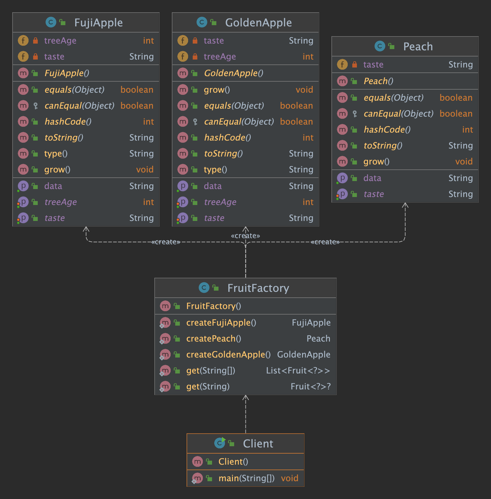

# Factory Method Design Pattern

## Purpose

- Returns an instance of one of several possible classes, depending on the data provided to it.
- Usually all of the classes it returns have a common parent class and common methods, but each of them
- Performs a task differently and is optimized for different kinds of data.

## Applicability/Use Case

- The creation is often static
- Also called Static Factory Method design pattern
- The object can be created based on the parameter received without knowing the details of how to create

### UML Diagram

### Base Implementation: 

- Interface IApple implements interface IFruit

### Interface IFruit and IApple Implementation:

- Classes Golden and Fuji Apple implement IApple
- Class Peach implement IFruit

### Advantages:

- Separated creation with usage
- Only need the parameter to create the object, don’t need the object’s name
- Can be configurable:
  - No change the client’s code to increase or replace the
  objects type

### Disadvantages:
- Factory contains logic to create objects
- Increased complexity as products increases
- Require changing logic to extend a new product