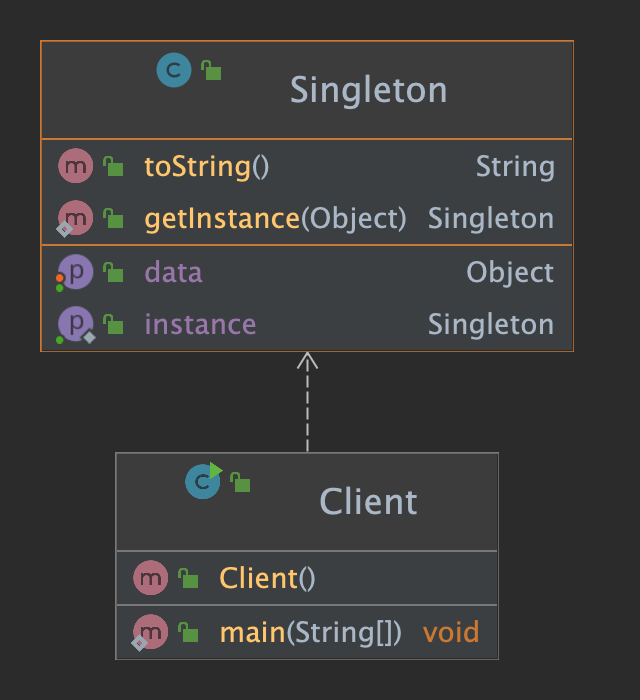
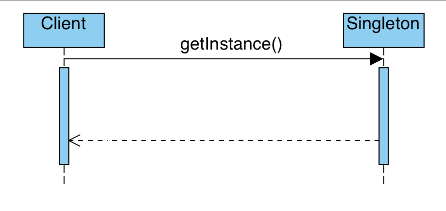

# Singleton Design Pattern

Definition: Singleton is an implementation of a class that only allows one instantiation.

## Where to use

Singleton should be considered only if all three of the following criteria are satisfied:
  - Ownership of the single instance cannot be reasonably assigned
  - Lazy initialization is desirable
  - Eager initialization is possible
  - No client can instantiate a Singleton object!
  - Global access is not otherwise provided for 
  - e.g.
    - When you need to ensure there's one instance of an object, available to a number of 
      other classes.
    - When you need to provide a registry, or something like a thread pool. Logging is also 
      another popular use <br> of Singletons, providing one single access point to an applications logfile.

## Class Diagram

- The class diagram representation of this pattern looks like:


[](./images/Singleton.Lazy.png "Class Diagram")

## Sequence Diagram

- The constructor is kept private, giving the `getInstance()` method the responsibility of 
providing access to the Singleton.

[](./images/SingletonSequenceDiagram.png "Sequence Diagram")


## Implementation

A simple implementation of the Singleton pattern below shows how we instantiate our 
Singleton class using lazy initialization. The class controls the only instance of 
itself and provides the `getInstance()` method as a way to access the class instance.

```java
class Singleton {
    private static Singleton UID = null;
    Object data = null;
    private Singleton(){}
    public  synchronized static Singleton getInstance(){
        // create a single instance of the class from a static context
        if (UID == null){UID = new Singleton();}
        return UID;
    }

}

class Client {
    private static final Logger log = LoggerFactory.getLogger(Client.class);
    public static void main(String[] args)
    {
        Singleton singleton = Singleton.getInstance();
        System.out.printf("\n%s", singleton.data);
    }
}
```

### Notes:

- Note that the singleton instance is only created when needed. 
  This is called lazy instantiation.


[//]: # (end of readme)